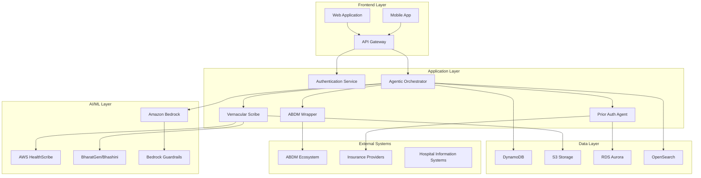

# Design Document: BharatHealth Agentic Orchestrator (BHAO)

## Overview

The BharatHealth Agentic Orchestrator (BHAO) is a comprehensive healthcare automation platform designed to integrate with India's Ayushman Bharat Digital Mission (ABDM) ecosystem. The system leverages cutting-edge AWS AI services including HealthScribe, Bedrock, and Guardrails to provide intelligent healthcare workflow automation while ensuring compliance with Indian data protection regulations.

The architecture follows a serverless, event-driven design pattern that enables scalable, cost-effective operations while maintaining high availability and security standards. The system serves as an intelligent intermediary between healthcare providers, patients, and the ABDM ecosystem, automating administrative tasks and enhancing clinical decision-making through agentic AI reasoning.

Key capabilities include:
- Real-time clinical documentation using AWS HealthScribe
- Automated prior authorization processing
- Multi-language support through BharatGen/Bhashini integration
- FHIR-compliant health data exchange
- Human-in-the-loop validation for clinical content
- Comprehensive audit trails and compliance reporting

## Architecture

### High-Level Architecture

The BHAO system follows a microservices architecture deployed on AWS serverless infrastructure:



### Service Architecture Patterns

**Event-Driven Architecture**: The system uses Amazon EventBridge for decoupled service communication, enabling asynchronous processing of healthcare workflows.

**CQRS Pattern**: Command Query Responsibility Segregation separates read and write operations, optimizing for both transactional consistency and query performance.

**Saga Pattern**: Distributed transactions across multiple services (ABDM integration, prior authorization, clinical documentation) are managed using the saga pattern for eventual consistency.

## Components and Interfaces

### Core Components

#### 1. Agentic Orchestrator
**Purpose**: Central intelligence hub using Amazon Bedrock for multi-step healthcare reasoning and workflow coordination.

**Key Responsibilities**:
- Orchestrate complex healthcare workflows
- Perform RAG-based analysis of medical data
- Coordinate between different system components
- Manage task state and workflow progression

**Technology Stack**:
- Amazon Bedrock with Claude 3.5 Sonnet
- Amazon Q Business integration
- AWS Lambda for serverless execution
- DynamoDB for state management

**API Interface**:
```typescript
interface AgenticOrchestrator {
  processWorkflow(workflowId: string, context: HealthcareContext): Promise<WorkflowResult>
  analyzeHealthData(patientId: string, dataType: HealthDataType): Promise<AnalysisResult>
  coordinateCare(careRequest: CareCoordinationRequest): Promise<CareCoordinationResponse>
  generateInsights(query: string, context: PatientContext): Promise<ClinicalInsights>
}
```

#### 2. Vernacular Scribe
**Purpose**: AI-powered clinical documentation system using AWS HealthScribe with multi-language support.

**Key Responsibilities**:
- Real-time audio transcription and speaker identification
- Clinical dialogue classification and structuring
- Multi-language processing using BharatGen/Bhashini
- Generation of structured clinical notes

**Technology Stack**:
- AWS HealthScribe for clinical transcription
- BharatGen/Bhashini for vernacular language processing
- Amazon S3 for audio storage
- AWS Lambda for processing orchestration

**API Interface**:
```typescript
interface VernacularScribe {
  transcribeAudio(audioStream: AudioStream, language: SupportedLanguage): Promise<TranscriptionResult>
  classifyDialogue(transcript: string): Promise<DialogueClassification>
  generateClinicalNotes(transcription: TranscriptionResult): Promise<ClinicalNotes>
  translateContent(content: string, targetLanguage: SupportedLanguage): Promise<TranslatedContent>
}
```

#### 3. Prior Authorization Agent
**Purpose**: Automated insurance prior authorization processing with intelligent form completion.

**Key Responsibilities**:
- Automatic population of insurance forms
- ICD-10 code validation and assignment
- Payer-specific form generation
- Submission tracking and status monitoring

**Technology Stack**:
- Amazon Bedrock for intelligent form processing
- Amazon RDS Aurora for insurance data
- AWS Lambda for processing logic
- Amazon SES for notifications

**API Interface**:
```typescript
interface PriorAuthAgent {
  processAuthorizationRequest(request: AuthorizationRequest): Promise<AuthorizationResult>
  validateMedicalCodes(procedures: MedicalProcedure[]): Promise<CodeValidationResult>
  generatePayerForms(patientData: PatientData, procedures: MedicalProcedure[]): Promise<PayerForms>
  trackSubmissionStatus(submissionId: string): Promise<SubmissionStatus>
}
```

#### 4. ABDM Wrapper
**Purpose**: Integration layer for ABDM services with FHIR bundle mapping and consent management.

**Key Responsibilities**:
- ABDM API integration and authentication
- FHIR R4 bundle mapping and validation
- Consent management and validation
- Health Information Provider (HIP) and User (HIU) services

**Technology Stack**:
- AWS Lambda for API integration
- Amazon API Gateway for external connectivity
- DynamoDB for consent tracking
- AWS KMS for encryption

**API Interface**:
```typescript
interface ABDMWrapper {
  authenticateWithABDM(credentials: ABDMCredentials): Promise<AuthenticationResult>
  retrieveHealthRecords(abhaId: string, consentId: string): Promise<FHIRBundle>
  validateConsent(patientId: string, requesterId: string): Promise<ConsentValidation>
  exchangeHealthInformation(hipRequest: HIPRequest): Promise<HIPResponse>
  requestExternalRecords(hiuRequest: HIURequest): Promise<HIUResponse>
}
```

### Supporting Components

#### 5. Authentication and Authorization Service
**Purpose**: Secure user authentication with role-based access control.

**Technology Stack**:
- Amazon Cognito for user management
- AWS IAM for service-to-service authentication
- JWT tokens for session management

#### 6. Data Security and Compliance Service
**Purpose**: Comprehensive data protection with AI safety guardrails.

**Technology Stack**:
- Amazon Bedrock Guardrails for PII redaction
- AWS KMS for encryption key management
- AWS CloudTrail for audit logging
- Amazon Macie for data classification

#### 7. Monitoring and Analytics Service
**Purpose**: Real-time system monitoring and business intelligence.

**Technology Stack**:
- Amazon CloudWatch for system metrics
- AWS X-Ray for distributed tracing
- Amazon QuickSight for analytics dashboards
- Amazon OpenSearch for log analysis

## Data Models

### Core Data Entities

#### Patient Entity
```typescript
interface Patient {
  abhaId: string                    // ABDM unique identifier
  personalInfo: PersonalInfo
  medicalHistory: MedicalHistory[]
  consentRecords: ConsentRecord[]
  languagePreference: SupportedLanguage
  createdAt: Date
  updatedAt: Date
}

interface PersonalInfo {
  name: string
  dateOfBirth: Date
  gender: Gender
  contactInfo: ContactInfo
  address: Address
  emergencyContact: EmergencyContact
}
```

#### Clinical Documentation Entity
```typescript
interface ClinicalDocument {
  documentId: string
  patientId: string
  providerId: string
  documentType: DocumentType
  content: ClinicalContent
  transcriptionData: TranscriptionData
  fhirBundle: FHIRBundle
  language: SupportedLanguage
  validationStatus: ValidationStatus
  auditTrail: AuditEntry[]
  createdAt: Date
  updatedAt: Date
}

interface ClinicalContent {
  chiefComplaint: string
  historyOfPresentIllness: string
  physicalExamination: string
  assessment: string
  plan: string
  medications: Medication[]
  diagnosticOrders: DiagnosticOrder[]
}
```

#### Prior Authorization Entity
```typescript
interface PriorAuthorization {
  authorizationId: string
  patientId: string
  providerId: string
  insuranceInfo: InsuranceInfo
  requestedProcedures: MedicalProcedure[]
  icdCodes: ICDCode[]
  payerForms: PayerForm[]
  submissionStatus: SubmissionStatus
  approvalStatus: ApprovalStatus
  submittedAt: Date
  responseAt?: Date
  expiresAt?: Date
}

interface MedicalProcedure {
  procedureCode: string
  description: string
  icdCode: string
  justification: string
  urgency: UrgencyLevel
  estimatedCost: number
}
```

#### ABDM Integration Entity
```typescript
interface ABDMSession {
  sessionId: string
  abhaId: string
  consentId: string
  requesterId: string
  dataTypes: HealthDataType[]
  consentStatus: ConsentStatus
  accessLog: AccessLogEntry[]
  expiresAt: Date
  createdAt: Date
}

interface FHIRBundle {
  resourceType: "Bundle"
  id: string
  type: BundleType
  timestamp: Date
  entry: FHIRResource[]
  signature?: Signature
}
```

#### Workflow State Entity
```typescript
interface WorkflowState {
  workflowId: string
  workflowType: WorkflowType
  currentStep: string
  stepHistory: WorkflowStep[]
  context: WorkflowContext
  status: WorkflowStatus
  assignedAgent: string
  priority: Priority
  createdAt: Date
  updatedAt: Date
  completedAt?: Date
}

interface WorkflowStep {
  stepId: string
  stepName: string
  status: StepStatus
  input: any
  output: any
  executedAt: Date
  duration: number
  errors?: Error[]
}
```

### Database Schema Design

#### DynamoDB Tables

**Primary Tables**:
- `Patients` - Patient demographic and consent data
- `ClinicalDocuments` - Clinical notes and transcription data
- `WorkflowStates` - Agentic orchestrator state management
- `ABDMSessions` - ABDM integration session tracking

**Secondary Tables**:
- `AuditLogs` - Comprehensive audit trail
- `ConsentRecords` - Patient consent management
- `SystemMetrics` - Performance and usage analytics

#### RDS Aurora Schema

**Insurance and Prior Authorization Data**:
- Structured relational data for insurance providers
- Prior authorization request tracking
- ICD-10 code validation tables
- Payer-specific form templates

#### S3 Storage Structure

**Audio and Document Storage**:
```
bhao-storage/
├── audio-recordings/
│   ├── {patientId}/
│   │   └── {sessionId}/
│       └── {timestamp}.wav
├── clinical-documents/
│   ├── {patientId}/
│   │   └── {documentId}.json
├── fhir-bundles/
│   ├── {patientId}/
│   │   └── {bundleId}.json
└── audit-logs/
    └── {date}/
        └── {hour}/
            └── audit-{timestamp}.json
```

### Data Flow Architecture

#### Clinical Documentation Flow
1. Audio input → AWS HealthScribe transcription
2. Transcription → BharatGen/Bhashini language processing
3. Processed text → Agentic Orchestrator for structuring
4. Structured data → FHIR bundle generation
5. FHIR bundle → Storage and ABDM integration

#### Prior Authorization Flow
1. Clinical data → ICD-10 code validation
2. Patient data + procedures → Payer form generation
3. Generated forms → Insurance provider submission
4. Submission tracking → Status updates and notifications

#### ABDM Integration Flow
1. Patient consent → ABDM authentication
2. Consent validation → Health record retrieval
3. Retrieved data → FHIR bundle mapping
4. FHIR data → Local processing and storage
5. All access → Comprehensive audit logging
## Correctness Properties

*A property is a characteristic or behavior that should hold true across all valid executions of a system—essentially, a formal statement about what the system should do. Properties serve as the bridge between human-readable specifications and machine-verifiable correctness guarantees.*

The following properties define the correctness requirements for the BharatHealth Agentic Orchestrator system. Each property is designed to be testable through property-based testing frameworks and validates specific requirements from the requirements document.

### Property 1: ABDM Authentication and Integration
*For any* valid ABDM credentials (M1, M2, M3 milestones) and ABHA_ID with proper consent, the system should successfully authenticate with ABDM services and retrieve consent-linked health records, while rejecting invalid credentials or unauthorized access attempts.
**Validates: Requirements 1.1, 1.2, 4.2**

### Property 2: Consent Validation and Audit Logging
*For any* patient data access request, the system should validate consent permissions through the Consent_Manager API before granting access and create comprehensive audit log entries for all access events, including security events and compliance reporting data.
**Validates: Requirements 1.3, 1.7, 5.6, 5.7**

### Property 3: FHIR Bundle Mapping Consistency
*For any* health data exchange, the system should map all data to valid FHIR R4 bundles in JSON/XML format that conform to FHIR specification standards and maintain data integrity during transformation.
**Validates: Requirements 1.6**

### Property 4: HIP/HIU Service Implementation
*For any* valid HIP service request or HIU external record request, the ABDM_Wrapper should implement all required endpoints and process requests according to ABDM specifications, returning appropriate responses or error codes.
**Validates: Requirements 1.4, 1.5**

### Property 5: Clinical Documentation and Language Processing
*For any* audio input in supported languages (Marathi, Hindi, English, and other Indian languages), the system should transcribe speech using AWS HealthScribe, classify dialogue into clinical categories, generate structured clinical notes in the selected vernacular language, and preserve medical terminology accuracy across all supported languages.
**Validates: Requirements 2.1, 2.3, 2.5, 7.1, 7.2, 7.3, 7.5**

### Property 6: Speaker Identification and Dialogue Classification
*For any* clinical transcription with multiple speakers, the system should automatically identify speaker roles (doctor, patient, family member) and classify conversations into appropriate clinical categories (symptoms, diagnosis, treatment plan).
**Validates: Requirements 2.2, 2.3**

### Property 7: Prior Authorization Workflow Automation
*For any* prior authorization request, the Prior_Auth_Agent should automatically populate insurance forms using patient data, validate and assign appropriate ICD-10 codes, generate payer-specific form formats, prepare submission-ready payloads, and track approval status with notifications to relevant parties.
**Validates: Requirements 3.1, 3.2, 3.3, 3.4, 3.5**

### Property 8: Data Security and Encryption
*For any* health data storage or access operation, the system should encrypt all data end-to-end using AWS encryption services, implement appropriate data masking for non-authorized personnel, use Bedrock Guardrails to redact PII in prompts and responses, and store documents in S3 with proper encryption.
**Validates: Requirements 5.2, 5.3, 5.4, 6.3**

### Property 9: AI Safety and Contextual Grounding
*For any* AI-generated clinical content, Bedrock Guardrails should provide contextual grounding to prevent hallucinations and ensure clinical accuracy while maintaining traceability to source data.
**Validates: Requirements 5.5**

### Property 10: Multimodal Language Support
*For any* user interaction or content processing, the system should support text, speech, and image inputs across 22 Indian languages, allow users to select their preferred language, and provide consistent functionality across all supported modalities.
**Validates: Requirements 7.1, 7.2, 7.6**

### Property 11: Clinical Data Processing and Validation
*For any* clinical data processing operation, the system should validate ICD-10 code accuracy and relevance, extract structured data from unstructured lab reports, validate clinical data consistency across multiple sources, provide traceable transcript references for AI-generated summaries, flag data discrepancies for human review, and allow clinicians to locate source insights in original transcripts.
**Validates: Requirements 8.2, 8.3, 8.4, 8.5, 8.6, 8.7**

### Property 12: RAG-Based Analysis and Workflow Automation
*For any* unstructured medical data or completed patient consultation, the system should analyze data using RAG-based techniques, automatically populate relevant forms, schedule appropriate follow-up care, coordinate with relevant healthcare providers, automate routine administrative processes, and detect workflow bottlenecks with optimization suggestions.
**Validates: Requirements 4.3, 4.4, 9.1, 9.2, 9.3, 9.6**

### Property 13: Metrics Tracking and Reporting
*For any* system activity or business process, the system should track and report quantifiable metrics including documentation time reduction, prior authorization processing speed, physician satisfaction scores, business impact metrics, and provide comprehensive reporting capabilities for compliance audits.
**Validates: Requirements 9.7, 10.4, 10.5**

### Property 14: Real-time Monitoring and Error Handling
*For any* system operation or error condition, the system should monitor critical performance metrics in real-time, generate alerts and diagnostic information when errors occur, and provide insights for workflow optimization based on usage pattern analysis.
**Validates: Requirements 10.1, 10.2, 10.3**

## Error Handling

### Error Classification and Response Strategy

The BHAO system implements a comprehensive error handling strategy that addresses the critical nature of healthcare data and the need for system reliability.

#### Critical Errors (System Halt Required)
- **ABDM Authentication Failures**: Complete system lockdown until credentials are validated
- **Data Encryption Failures**: Immediate halt of data processing operations
- **Consent Validation Failures**: Block all patient data access until consent is verified
- **FHIR Bundle Validation Failures**: Prevent data exchange until format compliance is achieved

#### Recoverable Errors (Graceful Degradation)
- **Transcription Service Unavailability**: Fall back to manual documentation with notification
- **Language Processing Failures**: Default to English with user notification
- **Prior Authorization Service Delays**: Queue requests with status tracking
- **External API Timeouts**: Implement exponential backoff with circuit breaker pattern

#### Warning Conditions (Monitoring and Alerting)
- **Data Quality Issues**: Flag for human review while allowing processing to continue
- **Performance Degradation**: Alert administrators while maintaining service
- **Consent Expiration**: Notify relevant parties with grace period
- **Storage Capacity Warnings**: Proactive scaling and cleanup procedures

### Error Recovery Mechanisms

#### Automatic Recovery
- **Circuit Breaker Pattern**: Prevent cascade failures in distributed services
- **Retry Logic**: Exponential backoff for transient failures
- **Fallback Services**: Alternative processing paths for critical functions
- **Data Replication**: Automatic failover to backup data sources

#### Human-in-the-Loop Recovery
- **Clinical Data Validation**: Mandatory human review for flagged discrepancies
- **Consent Resolution**: Human intervention for complex consent scenarios
- **Quality Assurance**: Clinical staff validation of AI-generated content
- **Escalation Procedures**: Clear escalation paths for unresolved errors

### Audit and Compliance Error Handling

#### Audit Trail Integrity
- **Immutable Logging**: All error events recorded in tamper-proof audit logs
- **Error Classification**: Systematic categorization for compliance reporting
- **Recovery Documentation**: Complete record of error resolution steps
- **Compliance Notifications**: Automatic alerts for regulatory-relevant errors

## Testing Strategy

### Dual Testing Approach

The BHAO system employs a comprehensive testing strategy that combines unit testing for specific scenarios with property-based testing for universal correctness validation.

#### Unit Testing Focus Areas
- **Integration Points**: ABDM API integration, AWS service connections
- **Edge Cases**: Invalid ABHA_IDs, malformed FHIR bundles, consent edge cases
- **Error Conditions**: Network failures, authentication timeouts, data corruption
- **Specific Examples**: Known clinical scenarios, standard prior authorization flows
- **Regulatory Compliance**: DPDP Act compliance scenarios, audit trail validation

#### Property-Based Testing Configuration

**Testing Framework**: The system uses **Hypothesis** (Python) for property-based testing with the following configuration:
- **Minimum 100 iterations** per property test to ensure comprehensive input coverage
- **Custom generators** for healthcare-specific data types (ABHA_IDs, FHIR bundles, clinical notes)
- **Shrinking strategies** optimized for healthcare data to find minimal failing examples

**Test Tagging Format**: Each property-based test must include a comment referencing its design document property:
```python
# Feature: bharathealth-agentic-orchestrator, Property 1: ABDM Authentication and Integration
```

#### Property Test Implementation Requirements

Each correctness property must be implemented by a **single property-based test** that:
1. **Generates diverse inputs** using healthcare-specific generators
2. **Validates universal properties** across all generated inputs
3. **References the design document property** in test comments
4. **Runs minimum 100 iterations** to ensure statistical confidence
5. **Includes shrinking strategies** to find minimal counterexamples

#### Healthcare-Specific Test Generators

**ABHA_ID Generator**: Creates valid and invalid ABHA_ID formats for authentication testing
**FHIR Bundle Generator**: Generates compliant and non-compliant FHIR R4 bundles
**Clinical Audio Generator**: Simulates audio transcription scenarios with multiple speakers
**Multi-language Content Generator**: Creates content in supported Indian languages
**Prior Authorization Generator**: Generates realistic prior authorization scenarios
**Consent Scenario Generator**: Creates various consent validation scenarios

#### Integration Testing Strategy

**End-to-End Workflows**: Test complete healthcare workflows from audio input to ABDM integration
**Service Mesh Testing**: Validate inter-service communication and error propagation
**Performance Testing**: Validate sub-second response times and scalability requirements
**Security Testing**: Penetration testing for data protection and access control
**Compliance Testing**: Automated validation of DPDP Act and HIPAA requirements

#### Continuous Testing Pipeline

**Pre-deployment Testing**: All property tests must pass before deployment
**Production Monitoring**: Continuous validation of system properties in production
**Regression Testing**: Automated testing of all properties on code changes
**Performance Benchmarking**: Regular validation of performance requirements
**Compliance Auditing**: Automated compliance testing and reporting

### Testing Coverage Requirements

**Unit Tests**: Minimum 90% code coverage for critical healthcare functions
**Property Tests**: 100% coverage of all correctness properties defined in design
**Integration Tests**: Complete coverage of all external service integrations
**Security Tests**: Comprehensive coverage of all data protection mechanisms
**Compliance Tests**: Full coverage of all regulatory requirements

The testing strategy ensures that the BHAO system maintains the highest standards of reliability, security, and compliance required for healthcare applications while providing comprehensive validation of all system properties and requirements.